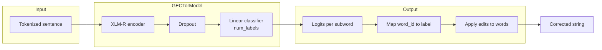
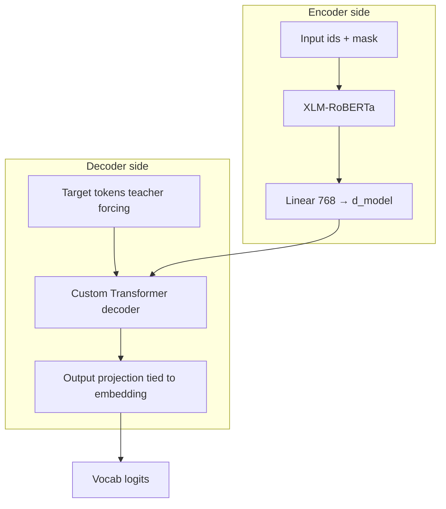

# GECTor vs GECModel

This project implements two grammatical error correction (GEC) approaches: a **GECToR-style edit tagger** and a **seq2seq GECModel** with a pretrained encoder and custom decoder.

---

## Quick comparison

| | **GECTor** (`train_gector.py`) | **GECModel** (`model/gec_model.py`) |
|---|----------------|----------------|
| **Task** | Predict an **edit label** per word: `$KEEP`, `$DELETE`, `$REPLACE_*`, `$INSERT_*` | **Seq2seq**: predict the **corrected sentence** token-by-token |
| **Output** | Discrete labels → **rule-based** string edits | Vocabulary logits → **autoregressive** generation (greedy in `infer.py`) |
| **Training loss** | Cross-entropy on token-aligned edit labels | Cross-entropy on shifted target tokens (teacher forcing) |
| **Encoder** | XLM-RoBERTa + linear classifier (typically both trained) | XLM-RoBERTa → linear projection → custom `Decoder`; encoder may be frozen or fine-tuned (`freeze_encoder`) |

---

## GECTor

### What it does

For each **whitespace word**, the model assigns **one** label from a **finite** vocabulary (top-K frequent edits from training data, plus `$KEEP` / `$DELETE`). Inference **does not** freely generate sentences: it **rewrites** the source by applying those operations. Multiple **passes** can be applied until the string stabilizes (`infer_gector.py`, `GECTOR_MAX_PASSES`).

### Architecture

- `AutoModel.from_pretrained(encoder_name)` (e.g. `xlm-roberta-base`)
- `Dropout` on `last_hidden_state`
- `Linear(hidden_size → num_labels)` — one logits vector per **subword** position
- Training aligns labels to **word_ids** (first subword of each word supervises the word)

**Code reference:** `GECTorModel` in `train_gector.py`.

### Training & artifacts

- **Train:** `train_gector.py` (optional language filter via `train_gector_es.py`)
- **Checkpoint:** e.g. `checkpoints/gector_model.pt`
- **Label vocab:** e.g. `checkpoints/gector_labels_word.pkl`

### Inference: `infer_gector.py`

1. Load checkpoint + label pickle (`id → label` string).
2. Forward pass → argmax label id per position.
3. For each **word**, take the label at the **first** subword (`word_ids`).
4. Apply rules: KEEP / DELETE / REPLACE / INSERT.
5. Repeat up to `max_passes` if the string changes.

### Evaluation: `evaluate_gector.py` / `evaluate_gector_es.py`

- Calls `correct()` from the matching `infer_gector` module.
- **Metric:** corpus-level **LCS** (longest common subsequence) between predicted and reference token sequences, then precision / recall / F0.5 (see `compute_f05` in `evaluate_gector.py`).
- **Note:** This is **not** the same formula as `evaluate.py` (set-based token overlap).

---

## GECModel

### What it does

The **encoder** encodes the erroneous sentence. The **decoder** generates the **correct** sentence autoregressively with cross-attention to encoder states. This is standard **encoder–decoder** style GEC with a **custom** decoder (`model/decoder.py`).

### Architecture

- **Encoder:** `xlm-roberta-base` (`AutoModel`), optionally frozen (`freeze_encoder=True`) or fine-tuned (`train_gec_ft.py` sets `False`).
- **Projection:** `Linear(768 → d_model)`.
- **Decoder:** Transformer-style stack with causal mask; output projection **tied** to decoder embedding weights.
- **`forward`:** `(input_ids, attention_mask, tgt)` → logits for next-token prediction over the tokenizer vocabulary.

**Code reference:** `GECModel` in `model/gec_model.py`.

### Training & artifacts

| Script | Encoder | Checkpoint (example) |
|--------|---------|-------------------------|
| `train.py` | Frozen (default) | `checkpoints/gec_model.pt` |
| `train_gec_ft.py` | Fine-tuned + split LRs | `checkpoints/gec_model_encoder_ft.pt` |

### Inference: `infer.py` / `infer_gec_ft.py`

1. Encode source → projected memory.
2. Start from BOS/CLS token id; **greedy** argmax for each next token.
3. Stop at EOS/SEP or max length.
4. `tokenizer.decode` → string.

`infer_gec_ft.py` reads optional `config` from the checkpoint to match `d_model`, layer counts, etc.

### Evaluation: `evaluate.py` / `evaluate_gec_ft.py`

- Calls `correct()` from the corresponding infer module.
- **Metric:** **Set-based** token overlap per sentence (precision / recall / F0.5) — same structure as `evaluate.py`.

**Important:** F0.5 numbers from `evaluate_gector.py` and `evaluate.py` are **not directly comparable** (different definitions). Use one shared metric if you compare systems.

---

## File map

| Role | GECTor | GECModel (frozen) | GECModel (encoder FT) |
|------|--------|-------------------|------------------------|
| Train | `train_gector.py`, `train_gector_es.py` | `train.py` | `train_gec_ft.py` |
| Infer | `infer_gector.py`, `infer_gector_es.py` | `infer.py` | `infer_gec_ft.py` |
| Eval | `evaluate_gector.py`, `evaluate_gector_es.py` | `evaluate.py` | `evaluate_gec_ft.py` |

---

## Summary

- **GECTor:** “What **edit** does each **word** need?” — tagger + deterministic rewrite; bounded by the **edit label** vocabulary.
- **GECModel:** “What **token sequence** is the correction?” — generative seq2seq; limited by tokenizer + decoding, not by a fixed edit set.
